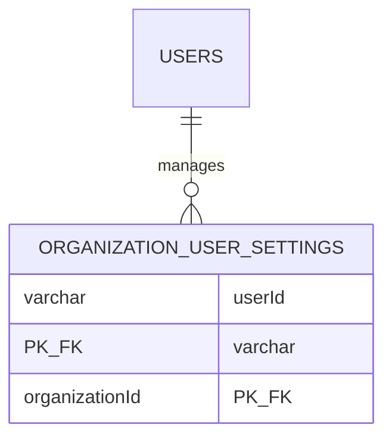
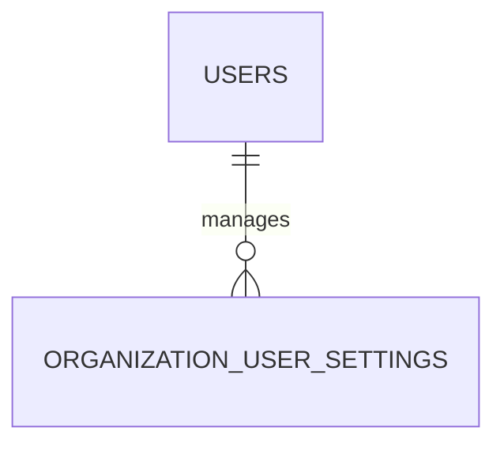
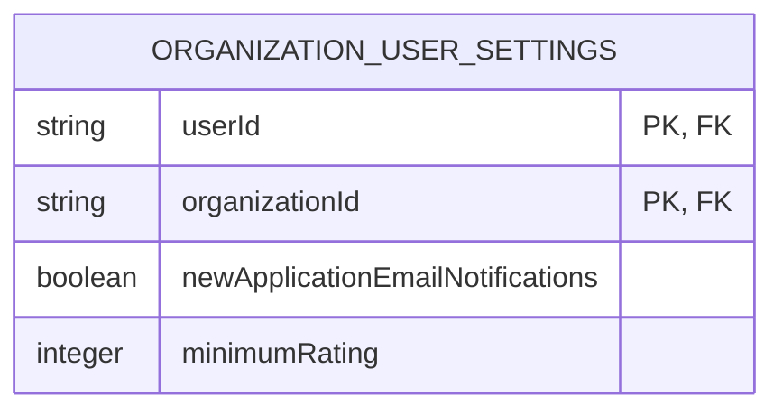
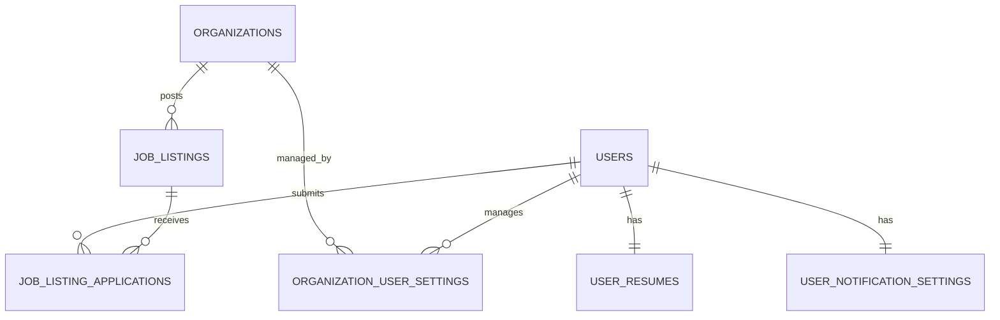

# KEY NOTES: Lessons Learned from Kore-Standards Development

**Author**: Wampamba Festo  
**Project**: Kore-Standards - AI-Powered Job Matching Platform  
**Institution**: Makerere University Business School (MUBS)  
**Period**: January 2026  
**Status**: Development Phase

---

## 📖 Overview

This document captures the critical lessons I learned while building the Kore-Standards platform. These are real-world challenges I faced, the solutions I implemented, and the knowledge I gained through the process. I'm documenting this both as a reference for future work and to help other developers who might encounter similar issues.

Throughout this project, I encountered challenges ranging from framework-specific migration issues to webhook configuration problems. Each challenge taught me something valuable about modern web development, and I want to ensure these lessons are preserved.

---

## 🚀 Table of Contents

1. [Next.js 16 Migration & Blocking Route Errors](#1-nextjs-16-migration--blocking-route-errors)
2. [Inngest Webhook Integration Challenges](#2-inngest-webhook-integration-challenges)
3. [File Naming Conventions & Import Management](#3-file-naming-conventions--import-management)
4. [Mermaid Diagram Syntax Errors in GitHub](#4-mermaid-diagram-syntax-errors-in-github)
5. [Project-Wide Renaming & Configuration Updates](#5-project-wide-renaming--configuration-updates)
6. [Database Schema Design & Migration Workflow](#6-database-schema-design--migration-workflow)
7. [Key Technical Skills Acquired](#7-key-technical-skills-acquired)
8. [Best Practices for Future Development](#8-best-practices-for-future-development)

---

## 1. Next.js 16 Migration & Blocking Route Errors

### 🔴 The Challenge

This was one of the most complex issues I faced. When I upgraded to Next.js 16, I started getting a critical error:

```
Route "/": Runtime data was accessed outside of <Suspense>.
This delays the entire page from rendering.
```

The error occurred because Clerk's authentication components (`SignedOut`, `SignedIn`, `UserButton`) were accessing server-side runtime data (via `headers()` and `auth()` functions) without being wrapped in React Suspense boundaries. This blocked the entire route from prerendering, which is a major performance issue in Next.js 16's new Partial Prerendering (PPR) feature.

**Additional complications**:

- The `cacheComponents` configuration moved from `experimental` to stable in Next.js 16.1
- Functions using `"use cache"` directive now **must** be async
- The `revalidateTag()` API changed to require a second argument (cacheLife profile)
- Hydration mismatches occurring with Clerk's dark mode theme

### 📚 What I Learned

1. **Understanding Partial Prerendering (PPR)**:
   - PPR allows Next.js to prerender static parts of a page while streaming dynamic parts
   - Components that access runtime APIs (`auth()`, `headers()`, `cookies()`) must be wrapped in `<Suspense>` boundaries
   - This enables the page to show static content immediately while loading dynamic content progressively

2. **Next.js 16 Breaking Changes**:
   - `cacheComponents` is now a top-level configuration option, not experimental
   - All functions with `"use cache"` must be async, even if they don't await anything
   - `revalidateTag()` now uses stale-while-revalidate (SWR) pattern with cache profiles

3. **React Suspense Boundaries**:
   - Suspense boundaries isolate components that need runtime data
   - They prevent blocking the entire route from rendering
   - Using `fallback={null}` gives a seamless loading experience without spinners

4. **SSR Hydration Patterns**:
   - When using browser-only APIs in client components, I need to track mount state
   - The server and client must render the same initial HTML to avoid hydration mismatches
   - Use `useEffect` to update state only after client-side mounting

### 🛠️ How I Fixed It

**Step 1: Updated `next.config.ts`**

```typescript
const nextConfig: NextConfig = {
  reactCompiler: true,
  cacheComponents: true, // Moved from experimental to top-level
};
```

**Step 2: Made cached functions async**

```typescript
// src/services/clerk/lib/getCurrentAuth.ts
export async function getCurrentAuth() {
  "use cache";
  cacheTag(getAuthTag());
  return auth();
}
```

**Step 3: Updated revalidateTag calls**

```typescript
// src/features/users/db/cache/users.ts
export function revalidateUserCache(id: string): void {
  revalidateTag(getUserGlobalTag(), "max"); // Added 'max' profile
  revalidateTag(getUserIdTag(id), "max");
}
```

**Step 4: Wrapped auth components in Suspense**

```tsx
// In page components
import { Suspense } from "react";

<Suspense fallback={null}>
  <SignedOut>
    <SignInButton />
  </SignedOut>
  <SignedIn>
    <UserButton />
  </SignedIn>
</Suspense>;
```

**Step 5: Fixed ClerkProvider hydration**

```typescript
// src/services/clerk/components/ClerkProvider.tsx
export function ClerkProvider({ children }) {
  const [mounted, setMounted] = useState(false);
  const [isDarkMode, setIsDarkMode] = useState(false);

  useEffect(() => {
    setMounted(true);
    setIsDarkMode(document.body.classList.contains("dark"));
  }, []);

  return (
    <OriginalClerkProvider
      appearance={mounted && isDarkMode ? { baseTheme: [dark] } : undefined}
    >
      {children}
    </OriginalClerkProvider>
  );
}
```

**Step 6: Migrated middleware.ts to proxy.ts**

- Renamed `src/middleware.ts` to `src/proxy.ts` (Next.js 16 convention)

### 🎯 Prevention Strategy

**For future Next.js upgrades**:

1. ✅ Always read the migration guide thoroughly before upgrading major versions
2. ✅ Check for experimental features that became stable
3. ✅ Test build process locally before committing changes
4. ✅ Use TypeScript strictly - it catches many config errors

**For new route components**:

1. ✅ Wrap any auth-checking components in `<Suspense>` boundaries
2. ✅ Use `fallback={null}` for invisible loading states
3. ✅ Test both authenticated and unauthenticated states

**For cached functions**:

1. ✅ Always make `"use cache"` functions async
2. ✅ Use `'max'` cacheLife profile for most revalidation cases
3. ✅ Add proper cache tags for granular invalidation

### 📝 What This Taught Me

This challenge fundamentally changed how I think about server and client rendering:

- **Server-first thinking**: I now design pages assuming parts will be static and parts will be dynamic
- **Performance consciousness**: Wrapping components in Suspense isn't just about fixing errors - it's about creating faster, better user experiences
- **Breaking changes are learning opportunities**: Instead of just fixing the error, I dove deep into understanding _why_ Next.js made these changes
- **Documentation is critical**: I updated DEV_NOTES.md extensively so my teammates would understand these patterns

**New skills acquired**:

- Understanding React Server Components deeply
- Implementing Partial Prerendering (PPR)
- Managing SSR hydration correctly
- Using cache tagging strategies effectively

---

## 2. Inngest Webhook Integration Challenges

### 🔴 The Challenge

I was trying to integrate Inngest to handle Clerk webhook events (specifically `clerk/user.created`) so that when a user signs up, their information would be automatically synced to our PostgreSQL database. However, I faced multiple blocking issues:

1. **404 Error on `/api/inngest` route**:

   ```
   PageNotFoundError: Could not find /api/inngest/route
   ```

   The route file existed, but Next.js wasn't recognizing it.

2. **Functions not appearing in Inngest dashboard**:
   Even after fixing the 404, my Inngest functions weren't being discovered by the Inngest Dev Server.

3. **Clerk webhooks not triggering the function**:
   When I sent test events from Clerk, nothing happened - no database inserts, no logs.

### 📚 What I Learned

1. **Next.js App Router Conventions**:
   - The App Router is **very strict** about directory naming
   - Routes must use **forward slashes** in the actual directory structure
   - Windows-style backslashes (`api\inngest`) are invalid even if they work in the file system
   - The route handler must be named `route.ts` (not `index.ts` or anything else)

2. **Inngest Event-Driven Architecture**:
   - Inngest functions must be explicitly exported and registered with `serve()`
   - The serve endpoint (`/api/inngest`) is how Inngest discovers your functions
   - Functions are **declarative** - you define what events they listen to
   - The Inngest Dev Server polls the `/api/inngest` endpoint to find functions

3. **Webhook Secret Management**:
   - Environment variables must be accessed correctly: `process.env.VARIABLE_NAME`
   - A hardcoded string like `"CLERK_WEBHOOK_SECRET"` is NOT the same as the actual secret
   - Webhook signature verification fails silently if the secret is wrong
   - Use T3 Env for type-safe environment variable access

4. **Function Registration Process**:
   ```
   Clerk Webhook → Next.js API → Inngest Serve Endpoint → Triggers Function → Database Insert
   ```

### 🛠️ How I Fixed It

**Problem 1: Route Not Found**

I discovered my directory structure was `src/app/api\inngest/route.ts` (backslash). I fixed it:

```bash
# Deleted the incorrectly named directory
rm -rf src/app/api\inngest

# Created correctly with forward slash
mkdir -p src/app/api/inngest
```

**Problem 2: Hardcoded Environment Variable**

Original code (WRONG):

```typescript
// src/services/inngest/functions/clerk.ts
export const clerkUserCreated = inngest.createFunction(
  { id: "clerk-user-created" },
  { event: "clerk/user.created" },
  async ({ event, step }) => {
    const isValidRequest = await clerk.verifyToken(event.data.token, {
      secretKey: "CLERK_WEBHOOK_SECRET", // ❌ This is a string literal!
    });
  },
);
```

Fixed code:

```typescript
// src/services/inngest/functions/clerk.ts
export const clerkUserCreated = inngest.createFunction(
  { id: "clerk-user-created" },
  { event: "clerk/user.created" },
  async ({ event, step }) => {
    const isValidRequest = await clerk.verifyToken(event.data.token, {
      secretKey: process.env.CLERK_WEBHOOK_SECRET!, // ✅ Actual environment variable
    });
  },
);
```

**Problem 3: Function Registration**

Ensured the function was properly exported and registered:

```typescript
// src/app/api/inngest/route.ts
import { serve } from "inngest/next";
import { inngest } from "@/services/inngest/client";
import { clerkUserCreated } from "@/services/inngest/functions/clerk";

export const { GET, POST, PUT } = serve({
  client: inngest,
  functions: [
    clerkUserCreated, // ✅ Explicitly registered
  ],
});
```

**Problem 4: Restarted Development Servers**

Inngest caches function discovery, so I had to restart:

```bash
# Terminal 1
pkill -f "pnpm dev"
pnpm dev

# Terminal 2
pkill -f "pnpm inngest"
pnpm inngest
```

### 🎯 Prevention Strategy

**For new Inngest functions**:

1. ✅ Always verify directory structure uses forward slashes
2. ✅ Check Inngest Dev Server dashboard to confirm function registration
3. ✅ Test with Inngest's "Test" button before testing with real webhooks
4. ✅ Add console logs in functions to confirm they're being triggered

**For environment variables**:

1. ✅ Never hardcode secrets - always use `process.env.VARIABLE_NAME`
2. ✅ Use T3 Env for type-safe validation
3. ✅ Add `.env.example` with placeholder values for teammates
4. ✅ Verify environment variables load correctly using `console.log` in development

**For webhook integrations**:

1. ✅ Test webhook signature verification separately before full integration
2. ✅ Use webhook testing tools (like Clerk's test events) before going to production
3. ✅ Implement proper error logging and monitoring

### 📝 What This Taught Me

**Root cause analysis matters**:

- My initial instinct was to think the problem was with Inngest configuration
- But the real issues were simple: wrong directory name and a typo in environment variable access
- I learned to check the basics first (file paths, env vars) before assuming complex issues

**Event-driven architecture understanding**:

- Inngest's model of "functions as a service" is powerful for decoupling concerns
- I can now trigger background jobs without blocking API responses
- This pattern will be crucial for scaling the platform (email notifications, AI processing, etc.)

**Environment variable security**:

- I now understand why it's critical to never commit `.env` files
- I set up proper secret management workflows
- I learned to use validation libraries (Zod + T3 Env) to catch missing variables at startup

**New skills acquired**:

- Event-driven serverless function design
- Webhook signature verification
- Debugging distributed systems (webhook → API → Inngest → database)
- Using Inngest Dev Server for local development

---

## 3. File Naming Conventions & Import Management

### 🔴 The Challenge

I had inconsistent file naming in the codebase that was causing confusion and errors:

1. **`user.ts` vs `users.ts`** - Database model was named `user.ts` but should be `users.ts` (plural) for consistency
2. **`SidebarUerButton.tsx`** - Typo: "Uer" instead of "User"

These seemed like small issues, but they had cascading effects:

- Import statements scattered across the codebase needed updating
- Type definitions were importing from the wrong paths
- Teammates were confused about which file was the "source of truth"
- The typo looked unprofessional and made the codebase harder to search

### 📚 What I Learned

1. **Naming Conventions Matter**:
   - Database models should use **plural names** (`users`, `organizations`) to match table names
   - Components should use **PascalCase** and be singular (`UserButton`, `JobCard`)
   - Consistent naming reduces cognitive load when navigating code

2. **Import Dependency Graphs**:
   - A single file rename can affect dozens of import statements
   - Modern IDEs (VS Code) can help, but you need to verify all changes
   - TypeScript's compiler is your friend - it shows all broken imports

3. **Refactoring Process**:
   - Git makes refactoring safer - always work on a feature branch
   - Rename files first, then fix imports, then test
   - Use Find & Replace carefully (regex can help)

4. **Testing After Refactoring**:
   - TypeScript compilation (`npx tsc --noEmit`) catches most issues
   - Development server (`pnpm dev`) reveals runtime import errors
   - Inngest integration needed separate testing

### 🛠️ How I Fixed It

**Step 1: Identified all affected files**

I used grep to find all imports:

```bash
# Find all imports of 'user.ts'
grep -r "from.*user" src/

# Find all references to SidebarUerButton
grep -r "SidebarUerButton" src/
```

**Step 2: Renamed the files**

```bash
# Rename database model
git mv src/features/users/db/cache/user.ts src/features/users/db/cache/users.ts

# Rename component (fix typo)
git mv src/components/sidebar/SidebarUerButton.tsx src/components/sidebar/SidebarUserButton.tsx
```

**Step 3: Updated all import statements**

Example changes:

```typescript
// Before
import { getUserGlobalTag } from "@/features/users/db/cache/user";

// After
import { getUserGlobalTag } from "@/features/users/db/cache/users";
```

```typescript
// Before
import { SidebarUerButton } from "@/components/sidebar/SidebarUerButton";

// After
import { SidebarUserButton } from "@/components/sidebar/SidebarUserButton";
```

**Step 4: Verified with TypeScript**

```bash
npx tsc --noEmit
# No errors = all imports fixed!
```

**Step 5: Tested runtime**

```bash
# Restarted dev servers
pnpm dev
pnpm inngest

# Checked Inngest dashboard for function registration
# Tested user creation flow
```

### 🎯 Prevention Strategy

**Naming standards established**:

1. ✅ **Database models**: Plural, lowercase (`users.ts`, `job-listings.ts`)
2. ✅ **React components**: Singular, PascalCase (`UserButton.tsx`, `JobCard.tsx`)
3. ✅ **Utilities/helpers**: Descriptive, camelCase (`formatDate.ts`, `parseResume.ts`)
4. ✅ **API routes**: Plural resources (`/api/users`, `/api/jobs`)

**Pre-commit checklist**:

1. ✅ Run TypeScript compiler to check for import errors
2. ✅ Run ESLint to catch style issues
3. ✅ Restart dev server to verify runtime compilation
4. ✅ Test affected features manually

**Code review guidelines**:

1. ✅ Flag inconsistent naming during PR reviews
2. ✅ Suggest better names before files proliferate
3. ✅ Keep a CONTRIBUTING.md with naming conventions

### 📝 What This Taught Me

**Details compound**:

- A typo seems minor, but it affects every developer who uses that component
- Consistent naming makes the codebase feel professional and well-maintained
- Small issues left unfixed create technical debt

**Refactoring confidence**:

- I learned to trust version control (Git) when making large changes
- TypeScript gives confidence that refactoring won't break things
- Incremental refactoring is safer than big bang rewrites

**Team considerations**:

- Even though I'm working solo on some tasks, I need to think about my teammates
- Clear naming helps onboarding new developers
- Documentation should reflect actual file names

**New skills acquired**:

- Using `git mv` to preserve file history during renames
- Using `grep` and regex for finding references across the codebase
- Systematic refactoring workflows
- Impact analysis for code changes

---

## 4. Mermaid Diagram Syntax Errors in GitHub

### 🔴 The Challenge

I created beautiful Mermaid diagrams for the `README.md` to visualize our system architecture and database schema. They rendered perfectly in VS Code, but when I pushed to GitHub, I got this error:

```
Syntax error in text
mermaid version 10.9.1
```

Specifically, the Entity Relationship Diagram (ERD) in the README was failing to render on GitHub. The error pointed to line 59 within the Mermaid block, which corresponded to the `ORGANIZATION_USER_SETTINGS` entity definition.

This was frustrating because:

- The diagram was essential for understanding our database design
- GitHub's Mermaid renderer is strict about syntax
- VS Code's preview was more forgiving and didn't show the errors
- I needed to make the README professional for academic submission

### 📚 What I Learned

1. **GitHub's Mermaid Renderer is Stricter**:
   - GitHub uses a specific version of Mermaid (10.9.1 at the time)
   - It's less forgiving than VS Code extensions or mermaid.live
   - What works locally might fail on GitHub

2. **ERDiagram Syntax Rules**:
   - Entity names must not contain special characters
   - Relationship labels containing special characters need to be quoted
   - Field names with parentheses or brackets must be quoted
   - The format is very sensitive to spacing and line breaks

3. **Debugging Mermaid Diagrams**:
   - Use [mermaid.live](https://mermaid.live) to test syntax
   - Check the exact Mermaid version GitHub uses
   - Read error messages carefully - they often point to the exact line
   - Test incrementally (comment out parts to isolate the issue)

4. **Best Practices for Mermaid in Documentation**:
   - Keep diagrams simple and readable
   - Use consistent formatting
   - Test on GitHub before finalizing
   - Provide both diagram and text descriptions

### 🛠️ How I Fixed It

**Problem: Unquoted special characters in relationship labels**

Original code (WRONG):



GitHub's parser was choking on the structure. I fixed it by:

1. **Simplifying relationship syntax**:



2. **Quoting field names with special characters**:



3. **Using consistent data types**:
   - Changed `varchar` to `string` (more universally supported)
   - Used `integer` instead of `int` (clearer)

**Full corrected ERD**:



**Step 4: Tested on mermaid.live**

I copied the entire diagram to [mermaid.live](https://mermaid.live) and verified it rendered correctly before committing.

**Step 5: Pushed and verified on GitHub**

After pushing, I checked the README on GitHub to confirm the diagram rendered correctly. Success!

### 🎯 Prevention Strategy

**For future Mermaid diagrams**:

1. ✅ Test on mermaid.live before adding to README
2. ✅ Use simple, unquoted labels when possible
3. ✅ Keep entity names alphanumeric (underscores OK)
4. ✅ Quote special characters in field names and labels
5. ✅ Check GitHub rendering immediately after pushing

**Documentation workflow**:

1. ✅ Draft diagrams in mermaid.live first
2. ✅ Test locally in VS Code
3. ✅ Push to a feature branch and check GitHub preview
4. ✅ Only merge to main after confirming rendering

**Error handling**:

1. ✅ Read error messages carefully - Mermaid errors are usually specific
2. ✅ Comment out sections to isolate problematic syntax
3. ✅ Compare working examples from Mermaid documentation

### 📝 What This Taught Me

**Tool compatibility matters**:

- Just because something works in one environment doesn't mean it works everywhere
- Always test in the target environment (GitHub in this case)
- Different tools have different parsers with varying strictness

**Documentation is a skill**:

- Good diagrams make complex systems understandable
- Visual documentation is as important as code comments
- Academic projects need polished documentation

**Debugging mindset**:

- When something fails remotely but works locally, environment differences are the likely culprit
- Use public testing tools (like mermaid.live) to reproduce issues
- Incremental testing (comment → test → uncomment) saves time

**New skills acquired**:

- Mermaid ERD diagram syntax
- Using mermaid.live for testing
- Understanding parser differences between tools
- Creating effective visual documentation

---

## 5. Project-Wide Renaming & Configuration Updates

### 🔴 The Challenge

Early in the project, I needed to rename everything from "work-connect-ug" to "kore-standards". This wasn't just a simple find-and-replace - it required:

1. **Updating package.json** (project name)
2. **Updating README.md and DEV_NOTES.md** (documentation)
3. **Updating environment variables** (database names)
4. **Updating Docker configurations** (container names)
5. **Updating Git repository URL**
6. **Fixing database connection strings**
7. **Ensuring no broken references**

The challenge was doing this **safely** without breaking the application.

### 📚 What I Learned

1. **Project Renaming is Systemic**:
   - A project name appears in many places: configs, docs, database names, URLs
   - Missing even one reference can cause obscure bugs
   - Git history is preserved with proper renaming techniques

2. **Configuration Files are Interconnected**:
   - `package.json` → affects build scripts
   - `docker-compose.yml` → affects container names and networking
   - `.env` → affects database connections
   - `next.config.ts` → affects build output

3. **Testing After Renaming**:
   - Database migrations need to be regenerated if DB name changes
   - Docker containers need to be recreated (not just restarted)
   - All services need testing (app, database, webhooks)

4. **Documentation Consistency**:
   - Code uses kebab-case (`kore-standards`)
   - Markdown uses PascalCase (`Kore-Standards`)
   - URLs use lowercase (`https://github.com/Festo-Wampamba/kore-standards`)

### 🛠️ How I Fixed It

**Step 1: Created implementation plan**

Before making any changes, I documented the plan to ensure I didn't miss anything.

**Step 2: Updated package.json**

```json
{
  "name": "kore-standards",
  "version": "0.1.0",
  "description": "AI-Powered Job Matching Platform for Uganda"
}
```

**Step 3: Updated Docker configuration**

```yaml
services:
  postgres:
    container_name: postgres_kore-standards
    environment:
      POSTGRES_DB: kore_standards
```

**Step 4: Updated environment variables**

```env
DB_NAME=kore_standards
```

**Step 5: Updated documentation**

- `README.md`: Updated title, repository URL, project name
- `DEV_NOTES.md`: Updated all references
- `LICENSE`: Updated project name and copyright

**Step 6: Regenerated database**

```bash
# Stopped old container
docker compose down -v

# Started new container with new name
docker compose up -d

# Applied migrations
pnpm db:migrate
```

**Step 7: Verified everything works**

```bash
# Ran type check
npx tsc --noEmit

# Started dev server
pnpm dev

# Tested database connection
pnpm db:studio
```

### 🎯 Prevention Strategy

**For project initialization**:

1. ✅ Choose the final name carefully before building too much
2. ✅ Use consistent naming from the start (kebab-case in code, PascalCase in docs)
3. ✅ Document naming conventions in CONTRIBUTING.md

**If renaming is necessary**:

1. ✅ Create a checklist of all affected files
2. ✅ Make changes on a feature branch
3. ✅ Test thoroughly before merging
4. ✅ Update documentation to match

**Configuration management**:

1. ✅ Use environment variables for configurable values
2. ✅ Keep `.env.example` updated with all required variables
3. ✅ Validate environment variables at application startup (use T3 Env)

### 📝 What This Taught Me

**Systematic thinking**:

- Large changes require planning and checklists
- Missing one config can cause hours of debugging
- Test each layer (code → build → runtime → database)

**Configuration management**:

- I learned how different config files interact
- Environment variables are the glue between services
- Proper abstraction (using T3 Env) prevents hardcoded values

**Git workflow**:

- Feature branches make risky changes safer
- Commit messages should explain why, not just what
- Git's history is valuable for understanding project evolution

**New skills acquired**:

- Multi-file refactoring workflows
- Docker container management and recreation
- Environment variable validation with Zod
- Systematic testing after major changes

---

## 6. Database Schema Design & Migration Workflow

### 🔴 The Challenge

Designing a database schema for a complex, multi-user platform with AI features was intimidating. I needed to:

1. **Design 7 interconnected tables** (users, organizations, jobs, applications, etc.)
2. **Handle complex relationships** (many-to-many, one-to-one, foreign keys)
3. **Optimize for Ugandan labor market** (districts, wage intervals, casual labor)
4. **Prepare for AI features** (resume embeddings, job matching scores)
5. **Ensure type safety** between database and application code
6. **Manage schema changes** with migrations

### 📚 What I Learned

1. **Schema Design Principles**:
   - **Normalize data** to avoid redundancy (separate users and organizations)
   - **Use composite keys** where appropriate (job applications: userId + jobListingId)
   - **Plan for extensibility** (status enums can be expanded later)
   - **Index strategically** (search fields like district, status, postedAt)

2. **Drizzle ORM Type Safety**:
   - Schema definitions are TypeScript code (not SQL)
   - TypeScript types are inferred from schema automatically
   - Changes to schema immediately show up in IDE autocomplete
   - Catches errors at compile time, not runtime

3. **Migration Workflow**:
   - **Never edit the database directly** - always change schema files
   - Migrations are generated automatically from schema differences
   - Migrations are version-controlled (can be reviewed in PRs)
   - Can roll back migrations if needed

4. **Uganda-Specific Adaptations**:
   - Added `daily` wage interval (casual labor is common)
   - Added `contract` job type (NGOs use project-based hiring)
   - Used `district` field (Uganda's administrative divisions)
   - Designed for low-bandwidth environments

5. **AI-Ready Schema**:
   - `user_resumes.aiSummary` stores extracted skills
   - `job_listing_applications.rating` stores AI match score (0-5)
   - `user_notification_settings.aiPrompt` allows personalized matching
   - Future: can add vector embedding columns for semantic search

### 🛠️ How I Implemented It

**Step 1: Modular schema design**

Instead of one giant file, I split schemas into logical modules:

```
src/drizzle/schema/
├── users.ts                    # User profiles
├── organizations.ts            # Employers
├── jobListings.ts             # Job posts
├── jobListingApplications.ts  # Applications
├── userResumes.ts             # Resume storage
├── userNotificationSettings.ts # Job seeker preferences
└── organizationUserSettings.ts # Employer preferences
```

**Step 2: Used schema helpers for consistency**

```typescript
// src/drizzle/schemaHelpers.ts
import { uuid, timestamp } from "drizzle-orm/pg-core";

export const id = uuid("id").primaryKey().defaultRandom();
export const createdAt = timestamp("createdAt").notNull().defaultNow();
export const updatedAt = timestamp("updatedAt").notNull().defaultNow();
```

**Step 3: Defined tables with relationships**

Example: Job Listings

```typescript
// src/drizzle/schema/jobListings.ts
export const JobListingTable = pgTable(
  "job_listings",
  {
    id,
    organizationId: varchar("organizationId")
      .notNull()
      .references(() => OrganizationTable.id),
    title: varchar("title").notNull(),
    description: text("description").notNull(),
    wage: integer("wage"),
    wageInterval: wageIntervalEnum("wageInterval"),
    district: varchar("district"), // Uganda-specific
    status: statusEnum("status").default("draft").notNull(),
    type: jobTypeEnum("type").notNull(),
    createdAt,
    updatedAt,
  },
  (table) => ({
    districtIdx: index("job_listings_district_idx").on(table.district),
    statusIdx: index("job_listings_status_idx").on(table.status),
  }),
);
```

**Step 4: Enumerated types for validation**

```typescript
export const wageIntervalEnum = pgEnum("wage_interval", [
  "hourly",
  "daily", // ← Uganda: casual labor
  "weekly",
  "monthly",
  "yearly",
]);

export const jobTypeEnum = pgEnum("job_type", [
  "internship",
  "part-time",
  "full-time",
  "contract", // ← Uganda: NGO projects
]);
```

**Step 5: Generated and applied migrations**

```bash
# After defining schemas
pnpm db:generate  # Creates SQL migration file

# Review the SQL
cat src/drizzle/migrations/0000_*.sql

# Apply to database
pnpm db:migrate
```

**Step 6: Verified with Drizzle Studio**

```bash
pnpm db:studio
# Opens visual database explorer at https://local.drizzle.studio
```

### 🎯 Prevention Strategy

**Schema design best practices**:

1. ✅ Sketch ERD diagram before writing code
2. ✅ Normalize data to 3rd normal form (3NF)
3. ✅ Use enums for constrained values
4. ✅ Add indexes on frequently queried fields
5. ✅ Plan for soft deletes if needed (add `deletedAt` column)

**Migration management**:

1. ✅ Never edit migration files manually
2. ✅ Review generated SQL before applying
3. ✅ Test migrations on development database first
4. ✅ Commit migrations with descriptive commit messages

**Type safety**:

1. ✅ Use Drizzle's type inference (`InferSelectModel`, `InferInsertModel`)
2. ✅ Validate API inputs with Zod schemas
3. ✅ Use strict TypeScript mode

### 📝 What This Taught Me

**Database design is crucial**:

- Good schema design makes features easier to implement later
- Poor schema design creates technical debt quickly
- Thinking about scale early prevents painful migrations

**Type safety is powerful**:

- Drizzle's TypeScript integration caught so many bugs
- Autocomplete makes development faster
- Refactoring is safer when types are strong

**Domain modeling skills**:

- I learned to think about relationships between entities
- Understanding cardinality (one-to-one, one-to-many, many-to-many)
- Translating real-world requirements into database constraints

**Uganda-specific thinking**:

- I learned to adapt generic patterns to local context
- Considered low-bandwidth environments
- Designed for both formal and informal sectors

**New skills acquired**:

- Drizzle ORM schema design
- PostgreSQL advanced features (enums, indexes, composite keys)
- Normalization and database optimization
- Migration management workflows
- ERD diagram creation with Mermaid

---

## 7. Key Technical Skills Acquired

Throughout this project, I've gained proficiency in several cutting-edge technologies and modern development practices. Here's a comprehensive list:

### 🔧 Frameworks & Libraries

#### **Next.js 16 (Advanced)**

- App Router and file-based routing
- React Server Components (RSC) and Server Actions
- Partial Prerendering (PPR) with Suspense boundaries
- Caching strategies (`"use cache"`, cache tags, revalidation)
- Middleware/Proxy configuration
- API route handlers
- Production build optimization

#### **React 19**

- Server Components vs Client Components
- Hooks (`useState`, `useEffect`, `useCallback`)
- SSR hydration patterns
- Event handling and state management
- Composition patterns

#### **TypeScript 5**

- Advanced type inference
- Generics (`InferSelectModel`, `InferInsertModel`)
- Type guards and narrowing
- Zod integration for runtime validation
- Strict mode configuration
- TSConfig optimization

### 🗄️ Database & ORM

#### **PostgreSQL 16**

- Relational database design
- Indexing strategies (B-tree, covering indexes)
- Foreign key constraints and cascading
- Enums and custom types
- Query optimization
- Transactions and ACID properties

#### **Drizzle ORM**

- Schema definition in TypeScript
- Type-safe query building
- Migration generation and management
- Relations (one-to-one, one-to-many, many-to-many)
- Drizzle Studio for database visualization
- Query performance optimization

### 🎨 Frontend & Styling

#### **Tailwind CSS 4**

- Utility-first CSS approach
- Responsive design patterns
- Custom configuration
- Dark mode implementation
- Component styling strategies

### 🔐 Authentication & Security

#### **Clerk**

- User authentication flows
- Organization management
- Middleware integration
- Webhook handling
- SSR auth patterns (`auth()`, `currentUser()`)
- Protected routes

### 🚀 Event-Driven Architecture

#### **Inngest**

- Function-as-a-service patterns
- Event-driven workflows
- Webhook integration
- Background job processing
- Function registration and discovery
- Local development with Inngest Dev Server

### 🛠️ DevOps & Tooling

#### **Docker**

- Container management
- Docker Compose orchestration
- Volume management
- Port mapping
- PostgreSQL containerization

#### **Git & Version Control**

- Feature branch workflows
- Conventional commits
- File renaming with history preservation
- Pull request reviews
- Merge conflict resolution

#### **Environment Management**

- T3 Env for type-safe variables
- Environment variable validation with Zod
- `.env` vs `.env.example` patterns
- Secret management

### 📊 Documentation & Diagramming

#### **Markdown & Mermaid**

- GitHub-flavored Markdown
- Mermaid diagram syntax (flow charts, ERDs)
- Technical documentation writing
- README and developer note creation

### 🧪 Testing & Debugging

- TypeScript type checking (`tsc --noEmit`)
- ESLint configuration
- Browser DevTools
- Server-side debugging
- Database query debugging with Drizzle Studio
- Webhook testing and validation

### 📦 Package Management

#### **pnpm**

- Monorepo management
- Lock file handling
- Dependency resolution
- Script running (`pnpm dev`, `pnpm build`)

---

## 8. Best Practices for Future Development

Based on all the challenges I faced, here are the best practices I'll follow going forward:

### 🎯 Development Workflow

1. **Always Work on Feature Branches**
   - Never commit directly to `main`
   - Use descriptive branch names: `feature/user-profile`, `fix/webhook-bug`
   - Test thoroughly before merging

2. **Test at Multiple Layers**

   ```bash
   # Type check
   npx tsc --noEmit

   # Lint
   pnpm lint

   # Build
   pnpm build

   # Runtime test
   pnpm dev
   ```

3. **Commit Early, Commit Often**
   - Small, atomic commits are easier to review and revert
   - Write clear commit messages explaining why, not what
   - Use conventional commits format

### 📝 Code Quality Standards

1. **Type Safety First**
   - Use TypeScript strict mode
   - Never use `any` type (use `unknown` if necessary)
   - Validate runtime data with Zod
   - Infer types from Drizzle schemas

2. **Environment Variable Management**
   - Never hardcode secrets
   - Always use T3 Env for validation
   - Keep `.env.example` updated
   - Validate at startup, fail fast

3. **Error Handling**
   - Add try-catch blocks around external API calls
   - Log errors with context
   - Return meaningful error messages to users
   - Use error boundaries in React

### 🗄️ Database Best Practices

1. **Schema Changes**
   - Never edit migrations manually
   - Review generated SQL before applying
   - Test migrations on dev database first
   - Use transactions for data migrations

2. **Query Optimization**
   - Add indexes on frequently queried fields
   - Use `select()` to limit returned fields
   - Avoid N+1 query problems
   - Monitor query performance with Drizzle Studio

3. **Data Integrity**
   - Use foreign key constraints
   - Add check constraints for business rules
   - Use enums for constrained values
   - Implement soft deletes where appropriate

### 🚀 Performance Optimization

1. **Next.js Caching**
   - Use `"use cache"` for expensive operations
   - Add cache tags for granular invalidation
   - Use Suspense boundaries to enable PPR
   - Monitor cache hit rates

2. **Image Optimization**
   - Use Next.js `<Image>` component
   - Provide `width` and `height` attributes
   - Use WebP format
   - Lazy load off-screen images

3. **Code Splitting**
   - Use dynamic imports for large components
   - Enable React Compiler
   - Analyze bundle size with `pnpm build`

### 📚 Documentation Standards

1. **Code Comments**
   - Explain why, not what
   - Document complex algorithms
   - Add JSDoc for public APIs
   - Update comments when code changes

2. **README and DEV_NOTES**
   - Keep setup instructions current
   - Document all environment variables
   - Include troubleshooting section
   - Add architecture diagrams

3. **Inline Documentation**
   - Use TypeScript types as documentation
   - Add Zod descriptions for validation schemas
   - Comment edge cases

### 🔒 Security Practices

1. **Authentication**
   - Use Clerk for all auth (don't roll your own)
   - Validate auth on every protected route
   - Use server-side auth checks, not client-side only
   - Implement CSRF protection

2. **API Security**
   - Validate all inputs with Zod
   - Rate limit API routes
   - Use HTTPS in production
   - Implement webhook signature verification

3. **Data Privacy**
   - Don't log sensitive data
   - Use environment variables for secrets
   - Implement proper access controls
   - Follow GDPR principles (data minimization, user consent)

### 🤝 Team Collaboration

1. **Pull Requests**
   - Write clear PR descriptions
   - Include screenshots for UI changes
   - Link to related issues
   - Respond to review comments promptly

2. **Code Reviews**
   - Review for logic, not just style
   - Test changes locally before approving
   - Suggest improvements, don't demand perfection
   - Approve quickly for minor changes

3. **Communication**
   - Document decisions in code comments or PR descriptions
   - Update team on blockers
   - Share learnings in team meetings
   - Keep documentation synchronized with code

---

## 🎓 Reflection & Growth

### What I'm Most Proud Of

1. **Overcoming complex technical challenges**: The Next.js 16 migration taught me to dive deep into framework internals rather than just applying surface fixes.

2. **Building a comprehensive database schema**: Designing 7 interconnected tables optimized for Uganda's labor market required both technical skill and domain understanding.

3. **Maintaining high documentation standards**: Creating detailed README, DEV_NOTES, and this KEY_NOTES document will help my team and future contributors.

4. **Thinking about real-world impact**: Every design decision considered the end users - Ugandan job seekers and employers.

### How My Development Approach Changed

**Before this project**:

- Fixed errors without understanding root causes
- Didn't read documentation thoroughly
- Avoided "complex" tools like Docker
- Wrote code without considering maintainability

**After this project**:

- Research errors systematically and understand the why
- Read migration guides and changelogs before upgrading
- Embrace modern tools (Docker, Inngest, Drizzle) for their benefits
- Write code thinking about the developer who will maintain it (future me!)

### Skills I Still Want to Develop

1. **AI/ML Integration**: Implementing vector embeddings and semantic search
2. **Testing**: Writing comprehensive unit and integration tests
3. **Performance Monitoring**: Using tools like Vercel Analytics
4. **Accessibility**: Ensuring the platform is usable by everyone
5. **Mobile Development**: Creating a native mobile app version

### Advice to My Past Self

1. **Read the documentation first** - It saves hours of trial and error
2. **Test in production-like environments early** - GitHub's Mermaid renderer issue could have been caught sooner
3. **Don't fear complexity** - Tools like Docker and Inngest are complex but worth learning
4. **Document as you go** - Writing this KEY_NOTES doc is easier while memories are fresh
5. **Celebrate small wins** - Every fixed bug is progress

---

## 📖 Lessons for Academic Context

Since this is a capstone project for MUBS, here's what I learned that's relevant to academic research:

### Design Science Research (DSR) Application

1. **Problem Identification**: Research before building
   - I studied Uganda's labor market fragmentation
   - Identified real pain points (ghost jobs, poor matching)
   - Grounded the solution in actual problems

2. **Design & Development**: Iterative building
   - Built incrementally (database → auth → API → UI)
   - Each challenge informed the next design decision
   - Documented design rationale in code and docs

3. **Evaluation**: Testing with intention
   - Type safety catches errors before users see them
   - Performance optimization improves user experience
   - Documentation enables reproducibility

### Research Skills Gained

1. **Literature Review**: Reading Next.js docs, Drizzle guides, Inngest tutorials
2. **Problem-Solving**: Systematic debugging and root cause analysis
3. **Technical Writing**: Creating clear, comprehensive documentation
4. **Critical Thinking**: Evaluating trade-offs (e.g., Drizzle vs Prisma, Clerk vs NextAuth)

### Contributions to Knowledge

1. **Uganda-Specific Adaptations**: Documenting how to adapt global tools to local contexts
2. **Migration Guides**: Detailed Next.js 16 migration notes could help other developers
3. **Integration Patterns**: Clerk + Inngest + Drizzle working together
4. **Open Source**: Will share code on GitHub for other students to learn from

---

## 🔮 Future Applications

How I'll apply these lessons to future projects:

### Short-Term (This Project)

1. **Implement AI matching engine** using what I learned about database schema and caching
2. **Build employer verification workflow** using Inngest event-driven patterns
3. **Create job seeker dashboard** with proper Suspense boundaries and PPR
4. **Deploy to production** on Vercel with environment variable management

### Long-Term (Career)

1. **Contribute to open source** - Now I understand how complex projects work
2. **Mentor junior developers** - Share lessons from this KEY_NOTES doc
3. **Build more full-stack applications** - Confidence in the entire stack
4. **Write technical blog posts** - Document learnings for the community

---

## 📚 Resources That Helped Me

### Documentation

- [Next.js Documentation](https://nextjs.org/docs) - Comprehensive and well-written
- [Drizzle ORM Documentation](https://orm.drizzle.team) - Excellent examples
- [Clerk Documentation](https://clerk.com/docs) - Clear integration guides
- [Inngest Documentation](https://www.inngest.com/docs) - Great for event-driven patterns
- [Mermaid Documentation](https://mermaid.js.org) - Visual diagram syntax

### Tools

- [mermaid.live](https://mermaid.live) - Testing Mermaid diagrams
- [TypeScript Playground](https://www.typescriptlang.org/play) - Testing type patterns
- [Drizzle Studio](https://local.drizzle.studio) - Visual database explorer
- [VS Code](https://code.visualstudio.com) - Best IDE for TypeScript/React

### Community

- [Next.js Discord](https://discord.gg/nextjs) - Quick help for framework questions
- [Stack Overflow](https://stackoverflow.com) - Finding solutions to common problems
- GitHub Issues - Learning from others' problems and solutions

---

## ✅ Conclusion

This project has been an incredible learning journey. Every challenge I faced taught me something valuable:

- **Technical depth**: I now understand modern web development at a deep level
- **Problem-solving**: I approach errors systematically instead of randomly trying fixes
- **Professional practices**: I write code with maintainability and team collaboration in mind
- **Real-world impact**: I'm building something that could genuinely help people in Uganda

The mistakes I made (hardcoded secrets, typos, syntax errors) are now lessons I'll never forget. The successes (type-safe database, efficient caching, proper auth) give me confidence to tackle even more complex challenges.

I'm excited to continue building Kore-Standards and applying everything I've learned to make it a platform that truly serves Uganda's job seekers and employers.

**Key Takeaway**: Challenges are learning opportunities. Document them, understand them, and share them with others.

---

**Document Version**: 1.0  
**Last Updated**: January 29, 2026  
**Next Review**: After completing AI matching engine implementation

---

_This document is a living record of my learning journey. I'll update it as I encounter new challenges and gain new insights._
