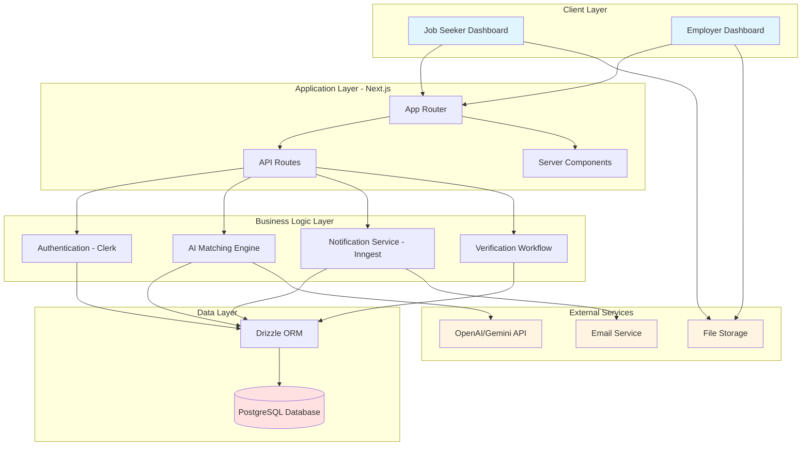

# Kore-Standards: AI-Powered Job Matching Platform for Uganda


## 📖 Project Overview

**Kore-Standards** is a capstone project developed by final-year Business Computing students at **Makerere University Business School (MUBS)**. The platform addresses the fragmentation in Uganda's labor market by centralizing employment opportunities and leveraging Artificial Intelligence to connect job seekers with legitimate employers.

Unlike traditional job boards, Kore-Standards utilizes **AI Vector Embeddings and Semantic Search** to understand the context of candidate skills and job requirements. This allows for higher-quality matches beyond simple keyword searching, reducing recruitment bias and improving hiring efficiency for both the formal and informal sectors.

### Problem Statement

Uganda's labor market faces significant challenges:

- **Fragmentation**: Job opportunities scattered across multiple platforms (LinkedIn, BrighterMonday, social media)
- **Ghost Jobs & Scams**: Unverified employers posting fraudulent job listings
- **Inefficient Matching**: Traditional keyword-based search missing qualified candidates
- **Accessibility**: Limited mobile-first solutions for low-bandwidth environments

### Solution Approach

Kore-Standards employs a **Design Science Research (DSR) methodology** to create an artifact (the platform) that addresses these identified problems through:

1. **Semantic AI Matching**: Vector embeddings for contextual skill-job alignment
2. **Employer Verification**: Multi-step verification workflows to ensure legitimacy
3. **Mobile-First Design**: Optimized for Uganda's average 5-15 Mbps bandwidth
4. **Dual-User System**: Specialized interfaces for job seekers and employers

---

## 🚀 Key Features

### Current Implementation

- ✅ **Database Schema**: Complete relational database with 7 tables optimized for Uganda's labor market
- ✅ **Type-Safe Data Layer**: Drizzle ORM with TypeScript and Zod validation
- ✅ **Dockerized Development**: PostgreSQL containerized for consistency
- ✅ **Modern Stack**: Next.js 16, React 19, Tailwind CSS 4

### Planned Features

- 🔄 **AI-Driven Matching**: Semantic recommendation engine using Vector Embeddings and Cosine Similarity
- 🔄 **Employer Verification**: Robust verification workflows to eliminate ghost jobs
- 🔄 **Real-Time Notifications**: Instant alerts via Inngest for matches and updates
- 🔄 **Authentication**: Clerk integration for secure user management
- 🔄 **Resume Processing**: AI-powered CV parsing and summarization
- 🔄 **Job Seeker Dashboard**: CV management, application tracking, personalized job alerts
- 🔄 **Employer Dashboard**: Job posting, candidate scoring, applicant management

---

## 🏗️ System Architecture

### Technology Stack

| Category            | Technology                                             | Purpose                                    |
| :------------------ | :----------------------------------------------------- | :----------------------------------------- |
| **Framework**       | [Next.js 16.1](https://nextjs.org/)                    | React framework with App Router            |
| **UI Library**      | [React 19](https://react.dev/)                         | Component-based UI development             |
| **Language**        | [TypeScript 5](https://www.typescriptlang.org/)        | Type-safe JavaScript                       |
| **Styling**         | [Tailwind CSS 4](https://tailwindcss.com/)             | Utility-first CSS framework                |
| **Database**        | [PostgreSQL 16](https://www.postgresql.org/)           | Relational database (Docker)               |
| **ORM**             | [Drizzle ORM 0.45](https://orm.drizzle.team/)          | Type-safe database toolkit                 |
| **Migrations**      | [Drizzle Kit 0.31](https://orm.drizzle.team/kit-docs/) | Schema migrations generator                |
| **Validation**      | [Zod 4.3](https://zod.dev/)                            | TypeScript-first schema validation         |
| **Env Management**  | [T3 Env](https://env.t3.gg/)                           | Type-safe environment variables            |
| **Package Manager** | [pnpm](https://pnpm.io/)                               | Fast, disk space efficient package manager |
| **Authentication**  | [Clerk](https://clerk.com/) _(planned)_                | User authentication & management           |
| **Event Handling**  | [Inngest](https://www.inngest.com/) _(planned)_        | Event-driven workflows & notifications     |
| **AI Processing**   | OpenAI / Gemini API _(planned)_                        | Vector embeddings for semantic matching    |
| **Hosting**         | [Vercel](https://vercel.com/) _(planned)_              | Serverless deployment platform             |

### Architecture Diagram



---

## 🗄️ Database Schema

### Entity Relationship Overview

```mermaid
erDiagram
    USERS ||--|| USER_RESUMES : "has"
    USERS ||--|| USER_NOTIFICATION_SETTINGS : "has"
    USERS ||--o{ ORGANIZATION_USER_SETTINGS : "manages"
    USERS ||--o{ JOB_LISTING_APPLICATIONS : "submits"

    ORGANIZATIONS ||--o{ JOB_LISTINGS : "posts"
    ORGANIZATIONS ||--o{ ORGANIZATION_USER_SETTINGS : "managed_by"

    JOB_LISTINGS ||--o{ JOB_LISTING_APPLICATIONS : "receives"

    USERS {
        varchar id PK
        varchar email UK
        varchar name
        varchar imageUrl
        timestamp createdAt
        timestamp updatedAt
    }

    ORGANIZATIONS {
        varchar id PK
        varchar name
        varchar imageUrl
        timestamp createdAt
        timestamp updatedAt
    }

    JOB_LISTINGS {
        uuid id PK
        varchar organizationId FK
        varchar title
        text description
        integer wage
        enum wageInterval
        varchar district
        varchar city
        boolean isFeatured
        enum locationRequirements
        enum experienceLevel
        enum status
        enum type
        timestamp postedAt
    }

    JOB_LISTING_APPLICATIONS {
        uuid jobListingId PK_FK
        varchar userId PK_FK
        text coverLetter
        text resumeUrl
        integer rating
        enum stage
    }

    USER_RESUMES {
        varchar userId PK_FK
        varchar resumeFileUrl
        varchar resumeFileKey
        text aiSummary
    }

    USER_NOTIFICATION_SETTINGS {
        varchar userId PK_FK
        boolean newJobEmailNotifications
        varchar aiPrompt
    }

    ORGANIZATION_USER_SETTINGS {
        varchar userId PK_FK
        varchar organizationId PK_FK
        boolean newApplicationEmailNotifications
        integer minimumRating
    }
```

### Table Descriptions

#### 1. **users** - Core User Profiles

Stores information for both job seekers and employers. Designed for Clerk authentication integration.

| Field     | Type      | Constraints           | Description                   |
| :-------- | :-------- | :-------------------- | :---------------------------- |
| id        | varchar   | PRIMARY KEY           | Clerk user ID                 |
| email     | varchar   | NOT NULL, UNIQUE      | User email address            |
| name      | varchar   | NOT NULL              | Full name                     |
| imageUrl  | varchar   | NOT NULL              | Profile picture URL           |
| createdAt | timestamp | NOT NULL, DEFAULT NOW | Account creation timestamp    |
| updatedAt | timestamp | NOT NULL, DEFAULT NOW | Last profile update timestamp |

#### 2. **organizations** - Employer Entities

Represents companies, NGOs, or individual employers posting jobs.

| Field     | Type      | Constraints           | Description                     |
| :-------- | :-------- | :-------------------- | :------------------------------ |
| id        | varchar   | PRIMARY KEY           | Clerk organization ID           |
| name      | varchar   | NOT NULL              | Organization name               |
| imageUrl  | varchar   |                       | Company logo URL                |
| createdAt | timestamp | NOT NULL, DEFAULT NOW | Organization creation timestamp |
| updatedAt | timestamp | NOT NULL, DEFAULT NOW | Last update timestamp           |

#### 3. **job_listings** - Job Postings

Central table for job opportunities with Uganda-specific adaptations.

| Field                | Type      | Constraints           | Description                                                 |
| :------------------- | :-------- | :-------------------- | :---------------------------------------------------------- |
| id                   | uuid      | PRIMARY KEY           | Auto-generated UUID                                         |
| organizationId       | varchar   | FK → organizations    | Posting organization                                        |
| title                | varchar   | NOT NULL              | Job title                                                   |
| description          | text      | NOT NULL              | Full job description                                        |
| wage                 | integer   |                       | Salary amount (in UGX or other currency)                    |
| wageInterval         | enum      |                       | hourly/daily/weekly/monthly/yearly (daily for casual labor) |
| district             | varchar   | INDEXED               | Ugandan district (e.g., Kampala, Wakiso)                    |
| city                 | varchar   |                       | City/town                                                   |
| isFeatured           | boolean   | DEFAULT false         | Premium listing flag                                        |
| locationRequirements | enum      | NOT NULL              | in-office/hybrid/remote                                     |
| experienceLevel      | enum      | NOT NULL              | junior/mid-level/senior                                     |
| status               | enum      | DEFAULT 'draft'       | draft/published/closed                                      |
| type                 | enum      | NOT NULL              | internship/part-time/full-time/contract (contract for NGOs) |
| postedAt             | timestamp | INDEXED               | Publication timestamp                                       |
| createdAt            | timestamp | NOT NULL, DEFAULT NOW | Creation timestamp                                          |
| updatedAt            | timestamp | NOT NULL, DEFAULT NOW | Last update timestamp                                       |

**Indexes**: district, status, organizationId, postedAt (optimized for search and filtering)

**Uganda-Specific Features**:

- `daily` wage interval for casual labor markets
- `contract` job type for NGO/project-based work common in Uganda
- `district` field for location-based filtering by Ugandan administrative divisions

#### 4. **job_listing_applications** - Application Tracking

Manages job applications with AI-powered candidate scoring.

| Field        | Type      | Constraints              | Description                                           |
| :----------- | :-------- | :----------------------- | :---------------------------------------------------- |
| jobListingId | uuid      | COMPOSITE PK, FK → jobs  | Applied job                                           |
| userId       | varchar   | COMPOSITE PK, FK → users | Applicant user                                        |
| coverLetter  | text      |                          | Optional cover letter                                 |
| resumeUrl    | text      | NOT NULL                 | Resume file URL                                       |
| rating       | integer   | CHECK (0-5)              | AI-generated candidate match score                    |
| stage        | enum      | DEFAULT 'applied'        | applied/shortlisted/interviewing/offer/hired/rejected |
| createdAt    | timestamp | NOT NULL, DEFAULT NOW    | Application submission time                           |
| updatedAt    | timestamp | NOT NULL, DEFAULT NOW    | Last status update time                               |

**Unique Feature**: Composite primary key prevents duplicate applications to the same job.

#### 5. **user_resumes** - Resume Storage

Stores resume files and AI-generated summaries for quick matching.

| Field         | Type      | Constraints           | Description                      |
| :------------ | :-------- | :-------------------- | :------------------------------- |
| userId        | varchar   | PRIMARY KEY, FK       | User who owns the resume         |
| resumeFileUrl | varchar   | NOT NULL              | Cloud storage URL                |
| resumeFileKey | varchar   | NOT NULL              | Storage provider key/identifier  |
| aiSummary     | varchar   |                       | AI-extracted skills & experience |
| createdAt     | timestamp | NOT NULL, DEFAULT NOW | Upload timestamp                 |
| updatedAt     | timestamp | NOT NULL, DEFAULT NOW | Last modification timestamp      |

#### 6. **user_notification_settings** - Job Seeker Preferences

Controls email notifications and personalized job matching.

| Field                    | Type      | Constraints           | Description                              |
| :----------------------- | :-------- | :-------------------- | :--------------------------------------- |
| userId                   | varchar   | PRIMARY KEY, FK       | User ID                                  |
| newJobEmailNotifications | boolean   | DEFAULT false         | Receive email alerts for new jobs        |
| aiPrompt                 | varchar   |                       | Custom prompt for AI job recommendations |
| createdAt                | timestamp | NOT NULL, DEFAULT NOW | Settings creation time                   |
| updatedAt                | timestamp | NOT NULL, DEFAULT NOW | Last update time                         |

#### 7. **organization_user_settings** - Employer Preferences

Links users to organizations they manage and configures application notifications.

| Field                            | Type      | Constraints           | Description                            |
| :------------------------------- | :-------- | :-------------------- | :------------------------------------- |
| userId                           | varchar   | COMPOSITE PK, FK      | User managing the organization         |
| organizationId                   | varchar   | COMPOSITE PK, FK      | Managed organization                   |
| newApplicationEmailNotifications | boolean   | DEFAULT false         | Email alerts for new applications      |
| minimumRating                    | integer   |                       | Auto-filter candidates below threshold |
| createdAt                        | timestamp | NOT NULL, DEFAULT NOW | Relationship creation time             |
| updatedAt                        | timestamp | NOT NULL, DEFAULT NOW | Last update time                       |

---

## 👥 The Team

**Project Title**: Developing a WorkConnect Management Platform for Employees and Employers in Uganda

**Supervised by**: Ms. Nyesiga Catherine (Department of Applied Computing & IT)

| Name                         | Registration Number | Role                     | Responsibilities                                      |
| :--------------------------- | :------------------ | :----------------------- | :---------------------------------------------------- |
| **Wampamba Festo**           | 23/U/18503/EVE      | Lead Developer / Backend | System architecture, database design, API development |
| **Grace Kyarikunda Bakeine** | 23/U/10491/PS       | Frontend / UI/UX         | User interface design, React components, user flows   |
| **Kamariza Hellena**         | 23/U/08844/PS       | Research / QA            | User research, testing, quality assurance             |
| **Kawere Edrine**            | 23/U/09440/PS       | Database Architect       | Schema design, query optimization, data integrity     |
| **Talemwa Daniella**         | 23/U/17830/EVE      | Documentation / Analysis | Technical documentation, system analysis              |

---

## 💻 Getting Started (Local Development)

Follow these instructions to set up the project locally on your machine.

### 1. Prerequisites

Ensure you have the following installed on your system:

- **Node.js** (v18 or later) - [Download](https://nodejs.org/)
- **pnpm** (Package Manager) - Install via `npm install -g pnpm`
- **Docker Desktop** - [Download](https://www.docker.com/products/docker-desktop/) (for PostgreSQL database)
- **Git** - [Download](https://git-scm.com/)

### 2. Clone the Repository

Download the code to your local machine:

```bash
git clone https://github.com/Festo-Wampamba/kore-standards.git
cd kore-standards
```

### 3. Set Up Environment Variables

Copy the example environment file and fill in your values:

```bash
cp .env.example .env
```

Edit `.env` and update the database credentials if needed:

```env
# Database Configuration
DB_USER=postgres
DB_PASSWORD=your_password
DB_NAME=kore_standards
DB_HOST=localhost
DB_PORT=5432
```

> **Note**: The application uses T3 Env to automatically construct the `DATABASE_URL` from these variables.

### 4. Start the PostgreSQL Database

Use Docker Compose to spin up the PostgreSQL container:

```bash
docker compose up -d
```

Verify the database is running:

```bash
docker ps
```

You should see `postgres_kore-standards` container running on port 5432.

### 5. Install Dependencies

Install all Node.js packages using pnpm:

```bash
pnpm install
```

### 6. Run Database Migrations

Apply the database schema to your PostgreSQL instance:

```bash
pnpm db:migrate
```

This creates all 7 tables with their relationships, indexes, and constraints.

### 7. Start the Development Server

Run the Next.js development server:

```bash
pnpm dev
```

Open [http://localhost:3000](http://localhost:3000) in your browser to see the application.

---

## 🛠️ Development Workflow

### Database Schema Changes

When modifying the database schema:

1. **Edit Schema Files**: Make changes in `src/drizzle/schema/*.ts`
2. **Generate Migration**: Run `pnpm db:generate` to create SQL migration files
3. **Review Migration**: Check `src/drizzle/migrations/*.sql` for accuracy
4. **Apply Migration**: Run `pnpm db:migrate` to apply changes to the database

### Code Organization

```
src/
├── app/                    # Next.js App Router (pages, layouts, routes)
├── drizzle/                # Database layer
│   ├── schema/             # Table definitions (modular approach)
│   ├── migrations/         # SQL migrations (auto-generated)
│   ├── schema.ts           # Central schema export
│   └── db.ts               # Database connection instance
└── data/env/               # Environment configuration with validation
```

### Branching Strategy

- `main` - Production-ready code
- `develop` - Integration branch for features
- `feature/*` - Feature development branches
- `bugfix/*` - Bug fix branches

### Commit Conventions

Use conventional commits for clear history:

```
feat: Add user profile page
fix: Resolve login redirect issue
docs: Update README installation steps
refactor: Extract job matching logic to service
```

---

## 🚀 Deployment

### Deploying to Vercel

1. **Push to GitHub**: Ensure your code is pushed to the GitHub repository
2. **Connect to Vercel**:
   - Visit [vercel.com](https://vercel.com/)
   - Import the `kore-standards` repository
3. **Configure Environment Variables**:
   - Add all `.env` variables to Vercel project settings
   - Set `DATABASE_URL` to your production PostgreSQL connection string
4. **Deploy**: Vercel auto-deploys on every push to `main`

### Production Database Setup

For production, use a managed PostgreSQL service:

- [Neon](https://neon.tech/) - Serverless Postgres (recommended for Vercel)
- [Supabase](https://supabase.com/) - PostgreSQL with additional features
- [Railway](https://railway.app/) - Simple database hosting

Run migrations on production:

```bash
pnpm db:migrate
```

---

## 📚 Academic Context

This project is developed using the **Design Science Research (DSR) methodology**, which involves:

1. **Problem Identification**: Analyzing Uganda's fragmented labor market
2. **Objective Definition**: Create a centralized, AI-powered job matching platform
3. **Design & Development**: Building the Kore-Standards platform
4. **Demonstration**: Testing with real users (planned)
5. **Evaluation**: Measuring match quality, user satisfaction, and employer verification effectiveness
6. **Communication**: Publishing findings and disseminating the platform

### Research Objectives

- Reduce time-to-hire for employers by 40% through AI matching
- Decrease fraudulent job postings by implementing verification workflows
- Improve job seeker discovery of relevant opportunities in low-bandwidth environments
- Contribute to scholarly understanding of AI applications in emerging labor markets

---

## 🤝 Contributing

As this is an academic project, contributions are currently limited to the team members listed above. However, feedback and suggestions are welcome!

### For Team Members

1. **Create a Feature Branch**: `git checkout -b feature/your-feature-name`
2. **Make Changes**: Follow coding standards and write clear commit messages
3. **Test Locally**: Ensure all features work as expected
4. **Push and Create PR**: Push to GitHub and create a Pull Request to `develop`
5. **Code Review**: Wait for at least one team member review before merging

---

## 🐛 Troubleshooting

### Common Issues

#### Database Connection Failed

```
Error: connect ECONNREFUSED 127.0.0.1:5432
```

**Solution**: Ensure Docker Desktop is running and PostgreSQL container is started:

```bash
docker compose up -d
docker ps  # Verify container is running
```

#### Port Already in Use

```
Error: Port 3000 is already in use
```

**Solution**: Kill the process or use a different port:

```bash
lsof -ti:3000 | xargs kill -9  # macOS/Linux
npx kill-port 3000             # Windows
# OR
pnpm dev -- -p 3001            # Use port 3001 instead
```

#### Environment Variables Not Loading

```
Error: DB_USER is required
```

**Solution**: Ensure `.env` file exists and is properly formatted. Restart the dev server after editing `.env`.

For more troubleshooting help, see [DEV_NOTES.md](./DEV_NOTES.md).

---

## 📄 License

This project is licensed under the **Apache License 2.0** - see the [LICENSE](./LICENSE) file for details.

Copyright 2026 Kore-Standards Development Team (Makerere University Business School)

---

## 📞 Contact

For inquiries about this project:

- **Lead Developer**: Wampamba Festo - [GitHub](https://github.com/Festo-Wampamba)
- **Academic Supervisor**: Ms. Nyesiga Catherine (MUBS Department of Applied Computing & IT)
- **Institution**: [Makerere University Business School](https://mubs.ac.ug/)

---

## Built with ❤️ by MUBS Business Computing Students
